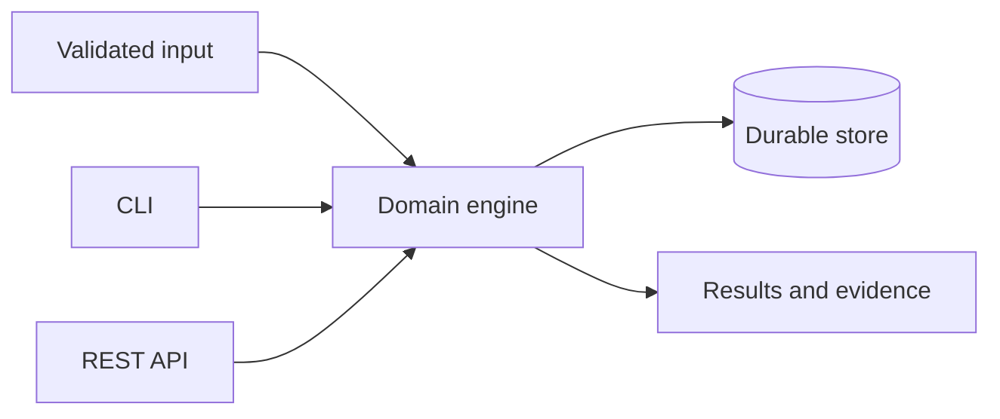

# TrustGate

**Cybersecurity · Backend Engineering · Identity**

## Problem
Applications frequently authenticate users without enforcing resource authorization, token lifecycle, or abuse controls.

## Who This Helps
Backend teams building multi-role APIs.

## Why It Matters
Broken access control, replayable tokens, brute force, and missing audit evidence expose sensitive resources.

## Constraints
The system must be inexpensive, inspectable, testable without paid services, conservative about claims, and safe with untrusted input. SQLite/local execution is the default; production deployments need deliberate persistence, identity, networking, and backup choices.

## Solution
A secure reference API combines password hashing, rotating refresh tokens, RBAC, ownership checks, lockout, rate limits, validation, and audit events.

## Architecture

See [architecture](docs/architecture.md).

## Features
The repository implements its domain engine, validation, durable/local state where applicable, executable interfaces, meaningful tests, structured errors, and automation.

## Technology Stack
Python 3.11 provides a portable typed core; FastAPI provides OpenAPI-backed HTTP endpoints; Typer provides operator-friendly commands; SQLite provides a zero-service evidence store. CloudForge instead uses Terraform, Docker, NGINX, and shell-based verification.

## Setup
```bash
python -m venv .venv
. .venv/bin/activate
pip install -e '.[dev]'
```
Copy `.env.example` to `.env` only for local overrides; `.env` is ignored.

## Usage
```bash
python -m app.cli --help
uvicorn app.api:app --host 127.0.0.1 --port 8000
```
CloudForge users should follow `docs/deployment.md`.

## Testing
```bash
pytest -q
```
Tests exercise domain behavior and failure paths without paid infrastructure.

## Security
Inputs are bounded and validated, secrets are accepted through the environment rather than source, errors avoid sensitive internals, and CI runs tests. See [security](docs/security.md) and [threat model](docs/threat-model.md).

## Limitations
It is a reference implementation, not an identity provider or a substitute for an external security review.

## Contributing
Read [CONTRIBUTING.md](CONTRIBUTING.md), add tests for behavior changes, and avoid real personal or secret data in fixtures.
