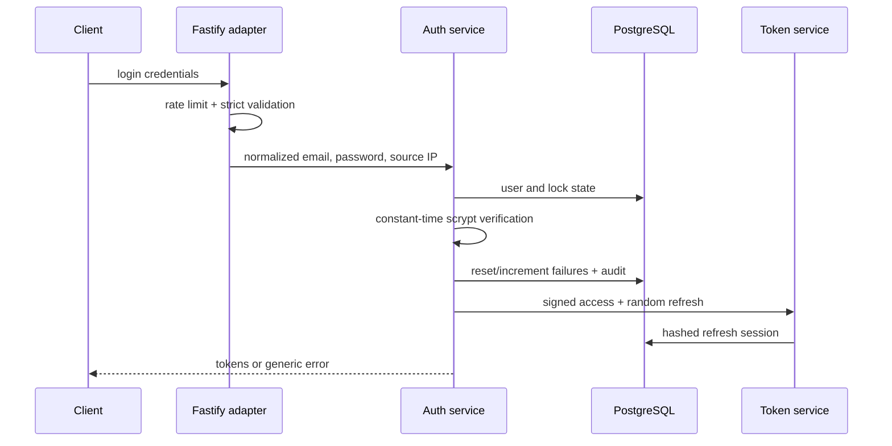

# TrustGate Architecture

## Request path

Every request crosses Fastify's body limit, security headers, and rate limiter before strict schema validation. Authentication establishes a principal from a signed token. Authorization then checks an explicit role permission and, for `:own` permissions, the resource owner. These are independent decisions. Outcomes that affect identity or protected evidence are appended to the audit store.

## Token lifecycle

Access JWTs last 15 minutes and bind issuer, audience, subject, role, expiry, and JTI under HS256. A refresh token is 256 random bits; only its SHA-256 hash is stored. Rotation atomically consumes the current row and inserts its replacement in the same family. Reusing a consumed token revokes every live token in that family.

## Persistence

PostgreSQL stores users, refresh sessions, and append-oriented audit events. Email uniqueness is case-insensitive. Foreign keys remove sessions with users while preserving audit records through nullable actor references. Refresh family and audit time indexes serve incident response paths. The in-memory adapter implements the same interface only for deterministic tests.

## Authorization model

`ADMIN` has all reference permissions. `MANAGER` can read users and write owned records. `USER` is limited to owned reads/writes. `AUDITOR` reads audit evidence. Possessing a role is insufficient for `:own` operations: the authenticated subject must equal the resource owner.
